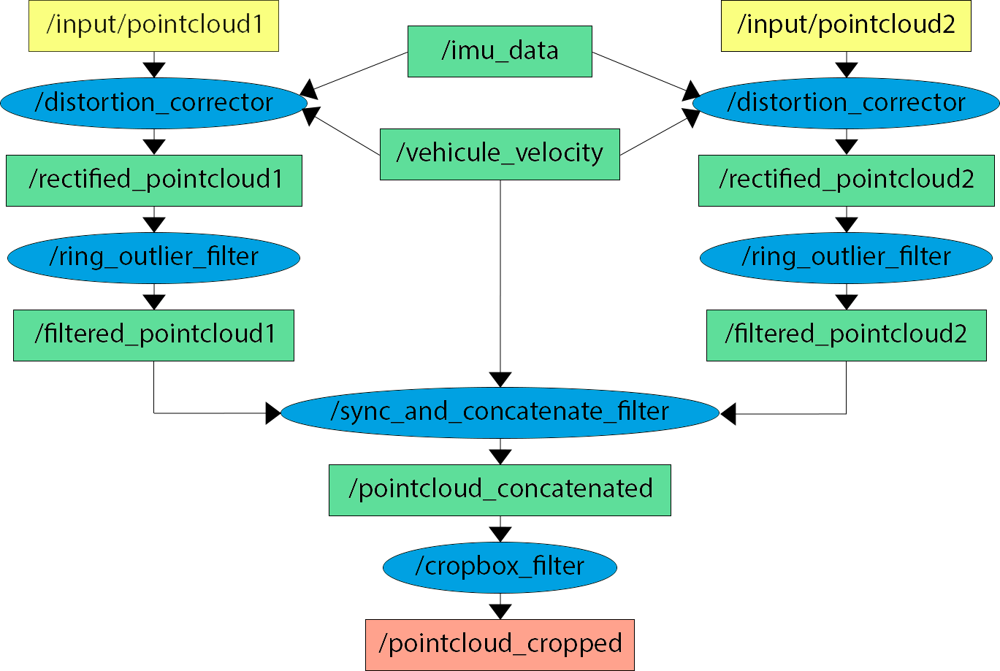
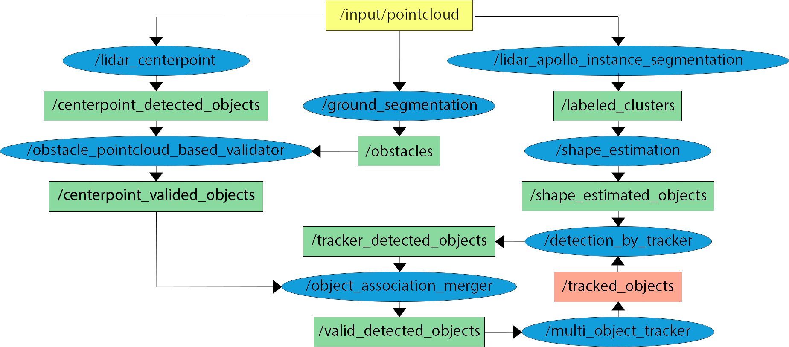

# Pointcloud Perception

## Purpose

pointcloud_perception is a package extracted from the Autoware universe[1] for tracking 3D objects from one or more pointcloud(s). 

## Inner-workings / Algorithms

This package can be separated in two parts:
- sensing
- perception

The sensing part uses the pointcloud_preprocessor filter from Autoware [link](src/sensing/pointcloud_preprocessor/README.md):

|Filter Name|Description|Detail|
| ----------------------------- | ---------------------------------------------------------------------------------- | --------------------------------------------- |
|distortion_corrector|Compensate pointcloud distortion caused by ego vehicle's movement during 1 scan|[link](src/sensing/pointcloud_preprocessor/docs/distortion-corrector.md)|
|ring_outlier_filter|	A method of operating scan in chronological order and removing noise based on the rate of change in the distance between points|[link](src/sensing/pointcloud_preprocessor/docs/ring-outlier-filter.md)|
|sync_and_concatenate_filter|Subscribe multiple pointclouds and concatenate them into a pointcloud|[link](src/sensing/pointcloud_preprocessor/docs/concatenate-data.md)|
|cropbox_filter|Remove points within a given box|[link](src/sensing/pointcloud_preprocessor/docs/crop-box-filter.md)|
|downsample_filter (approximate_downsample_filter)|	Downsampling input pointcloud|[link](src/sensing/pointcloud_preprocessor/docs/downsample-filter.md)|

The preprocessing stages are illustrated in the diagram below:

If only one topic is given in input, the `sync_and_concatenate_filter` node will not be launched.

The perception part uses packages from Autoware and Apollo[2]:

| Package Name                   | Description                                                                        | Detail                                        |
| ----------------------------- | ---------------------------------------------------------------------------------- | --------------------------------------------- |
| lidar_centerpoint              | lidar_centerpoint is a package for detecting dynamic 3D objects| [link](src/perception/lidar_centerpoint/README.md)              |
| ground_segmentation (ray_ground_filter) |The ground_segmentation is a node that remove the ground points from the input pointcloud.|[link](src/perception/ground_segmentation/README.md)|
| detected_object_validator (obstacle_pointcloud_based_validator)              | The purpose of this package is to eliminate obvious false positives of DetectedObjects                                                 | [link](src/perception/detected_object_validation/README.md)               |
| lidar_apollo_instance_segmentation          | This node segments 3D pointcloud data from lidar sensors into obstacles  | [link](src/perception/lidar_apollo_instance_segmentation/README.md)          |
| shape_estimation             | This node calculates a refined object shape (bounding box, cylinder, convex hull) in which a pointcloud cluster fits according to a label                                                  | [link](src/perception/shape_estimation/README.md)             |
| detection_by_tracker             | This package feeds back the tracked objects to the detection module to keep it stable and keep detecting objects| [link](src/perception/detection_by_tracker/README.md)             |
| object_merger             | object_merger is a package for merging detected objects from two methods by data association| [link](src/perception/object_merger/README.md)             |
| multi_object_tracker             | The main purpose is to give ID and estimate velocity of a detected object| [link](src/perception/multi_object_tracker/README.md)             |

The preprocessing stages are illustrated in the diagram below:

## Inputs / Outputs

### Inputs

| Name                 | Type                            | Description      |
| -------------------- | ------------------------------- | ---------------- |
| `pointcloud_topics` | array of `sensor_msgs::msg::PointCloud2` | array of input topic(s) |
|`input/imu`|`geometry_msgs::msg::TwistWithCovarianceStamped`|twist|
|`input/twist`|`sensor_msgs::msg::Imu`|imu data|
### Output

| Name                       | Type                                             | Description          |
| -------------------------- | ------------------------------------------------ | -------------------- |
| `output/object_tracker`         | `autoware_perception_msgs::msg::TrackedObjects` | tracked objects     |

TrackedObjects message contain an array of TrackedObject.
An TrackedObject is:

| Name                       | Type                                   | Description          |
| -------------------------- | -------------------------------------- | -------------------- |
|`object_id`|unique_identifier_msgs/UUID|Unique identifier|
|`existence_probability`|float32|Probability of existence|
|`classification`|ObjectClassification[]|If it is a UNKNOWN=0, CAR=1, TRUCK=2, BUS=3, TRAILER=4, MOTORCYCLE=5, BICYLE=6, PEDESTRIAN=7 and the associated probability (float32) |
|`pose_with_covariance`|geometry_msgs/PoseWithCovariance|Position (x, y, z, rotation about X axis, rotation about Y axis, rotation about Z axis) of the object with uncertainty|
|`twist_with_covariance`|geometry_msgs/TwistWithCovariance|Velocity (linear and angular) of the object with uncertainty|
|`acceleration_with_covariance`|geometry_msgs/AccelWithCovariance|Acceleration (linear and angular) of the object with uncertainty|
|`orientation_availability`|uint8|If only position is available and not the orientation = 0, if direction is known, and need to choose arbitrarily a orientation = 1, if full orientation available = 2|
|`is_stationary`|bool| Object is stationary or in movement|
|`type`|uint8|Bounding_box=0, Cylinder=1,Polygon=2|
|`footprint`|geometry_msgs/Polygon|Floor space occupied by the object|
|`dimensions`|geometry_msgs/Vector3|Dimensions of the shape|

## Parameters
### Core Parameters

| Name                                             | Type         | Default Value             | Description                                                   |
| ------------------------------------------------ | ------------ | ------------------------- | ------------------------------------------------------------- |
|`input_frame`|string|`velodyne`|input frame id|
|`output_frame`|string|`base_link`|output frame id|
|`launch_downsample_filter_node`|bool|`true`|if true, downsample the pointcloud after beeing preprocessed by the sensing part|
|`voxel_size_x`|double|`0.15`|voxel size x [m] (downsample node)|
|`voxel_size_s`|double|`0.15`|voxel size y [m] (downsample node)|
|`voxel_size_z`|double|`0.1`|voxel size z [m] (downsample node)|
|`crop_coord`|array of int|`[-50.0,50.0,-100.0,200.0,-2.0,3.0]`|Coordinate of the polygon where points outside are ignored [x_min,x_max,y_min,y_max,z_min,z_max]|

Parameters can be set in the command line, e.g `'input_frame':='livox_frame'`.

## Measuring the performance

Consult the readme.md of the node whose performance you want to measure.

## References
[1] <https://github.com/autowarefoundation/autoware.universe/tree/main>

[2] <https://github.com/ApolloAuto/apollo>